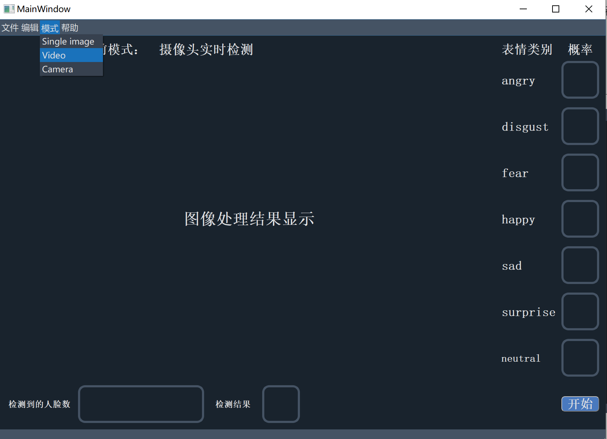
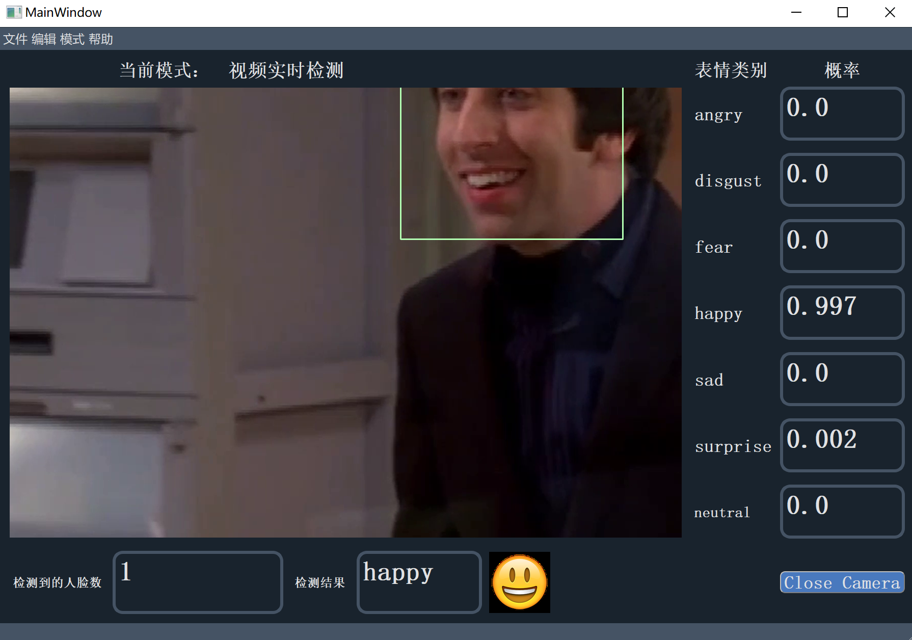

# facial-expression-recognition-ui

> 代码即将发布。 

> It is coming soon.

## Introduction

使用pyqt5实现了人脸面部表情的实时检测界面设计，包括以下功能：

1. 单幅图像检测模式：选择本地的单幅图像进行预测，可以保存检测结果图像

2. 视频实时检测模式：选择本地的视频实现实时表情检测

3. 摄像头实时检测模式：使用摄像头进行实时表情检测

此外还实现了对当前检测到的人脸数目的检测、各类表情的概率（七大表情:angry, disgust, fear, happy, sad, surprise, neutral）等

检测界面：

## Requirement

注意：

opencv版本必须为4.1.2.30，否则会和pyqt5冲突

`pip install python-opencv==4.1.2.30`

## Quick Start

`python main.py`

其他使用问题可以在“帮助”中查看

## Reference

https://github.com/phamquiluan/ResidualMaskingNetwork
